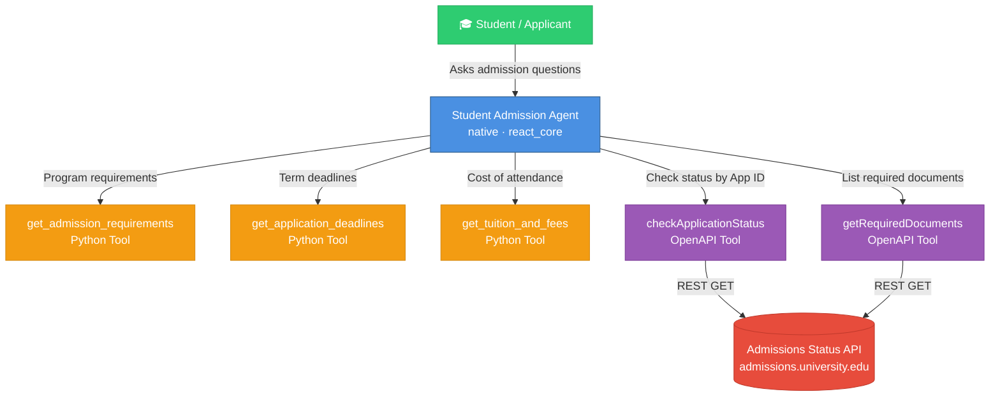

# Student Admission Agent

An IBM watsonx Orchestrate native agent that assists prospective and current students with every aspect of the university admissions process — admission requirements, application deadlines, tuition fees, and real-time application status checks.

---

## Architecture Diagram



---

## Tool Inventory

| Tool | Kind | Capability |
|------|------|-----------|
| `get_admission_requirements` | Python | Returns GPA, test scores, documents, and special requirements for any program and level |
| `get_application_deadlines` | Python | Returns early action, regular decision, financial aid, and scholarship deadlines by term |
| `get_tuition_and_fees` | Python | Returns full cost-of-attendance breakdown by program, level, and residency status |
| `checkApplicationStatus` | OpenAPI | Calls the live Admissions API to return real-time status, checklist, and next steps |
| `getRequiredDocuments` | OpenAPI | Returns the list of required and submitted documents for an application |

---

## Example Conversations

### Check Application Status
```
Student: Can you check my application status? My ID is APP-2024-001234
Agent:   → Calls checkApplicationStatus(application_id="APP-2024-001234")
         Your application for Bachelor of Science in Computer Science is currently
         Under Review (75% complete). One document is still missing:
         ✗ Official High School Transcript
         Please submit it from your school directly. Estimated decision: January 31.
```

### Admission Requirements
```
Student: What do I need to apply for the MBA program?
Agent:   → Calls get_admission_requirements(program="MBA", level="graduate")
         Requirements for MBA (Graduate):
         • Minimum GPA: 3.0
         • Tests: GMAT ≥ 550 or GRE ≥ 300 (TOEFL ≥ 90 for international)
         • Documents: Application, transcripts, statement of purpose,
           3 recommendations, résumé, $75 fee
```

### Tuition Inquiry
```
Student: How much does it cost for an international graduate student?
Agent:   → Calls get_tuition_and_fees(residency="international", level="graduate")
         2024–2025 Graduate Tuition (International):
         • Per credit hour: $1,050
         • Full-time (12 cr): $12,600/semester
         • Mandatory fees: $450/semester
         • Estimated total: $36,000–$42,000/year
         85%+ of students receive financial assistance. File FAFSA by Feb 1.
```

---

## Project Structure

```
student-admission-agent/
├── __init__.py
├── import-all.sh                              # CLI import script
├── README.md                                  # This file
├── agents/
│   └── student_admission_agent.yaml           # Agent configuration
├── tools/
│   ├── __init__.py
│   ├── admission_tools.py                     # Python tools (requirements, deadlines, fees)
│   └── check_application_status_openapi.yaml  # OpenAPI spec for status API
└── generated/                                 # Compiled artifacts (auto-generated)
```

---

## Setup & Deployment

### Prerequisites
- IBM watsonx Orchestrate ADK installed (`pip install ibm-watsonx-orchestrate`)
- Authenticated with your Orchestrate environment (`orchestrate env activate`)

### Import All Resources
```bash
cd student-admission-agent
bash import-all.sh
```

This will import in order:
1. Python tools (`admission_tools.py`)
2. OpenAPI tool (`check_application_status_openapi.yaml`)
3. Agent (`student_admission_agent.yaml`)

### Start a Chat Session
```bash
orchestrate chat start
# Select: student_admission_agent
```

---

## Configuration

### Connecting the Real Application Status API

The OpenAPI spec at [`tools/check_application_status_openapi.yaml`](tools/check_application_status_openapi.yaml) targets `https://admissions.university.edu/api/v1`.

To connect to your real API:
1. Update the `servers.url` in the OpenAPI spec to your actual API endpoint.
2. If authentication is required, create a connection:
   ```bash
   # API Key authentication example
   orchestrate connections configure -a admissions_api --kind api_key
   orchestrate connections set-credentials -a admissions_api --api-key <YOUR_KEY>
   ```
3. Reference the connection in the OpenAPI import:
   ```bash
   orchestrate tools import -k openapi -f tools/check_application_status_openapi.yaml --app-id admissions_api
   ```

### Switching the LLM

The agent uses `groq/openai/gpt-oss-120b` by default. To change it, edit the `llm` field in [`agents/student_admission_agent.yaml`](agents/student_admission_agent.yaml):

```yaml
llm: watsonx/ibm/granite-13b-chat-v2   # Example alternative
```

---

## Starter Prompts (shown in chat UI)

| Title | Prompt |
|-------|--------|
| Check my application status | "I'd like to check the status of my admission application. My application ID is APP-2024-001234." |
| Admission requirements | "What are the admission requirements for the Computer Science undergraduate program?" |
| Application deadlines | "What are the application deadlines for Fall semester?" |
| Tuition and fees | "How much does it cost to attend as an international graduate student?" |

---

## Extending the Agent

| Need | Approach |
|------|----------|
| Add scholarship search | Add a new `@tool` in `admission_tools.py` and register it in the agent YAML |
| Add document upload tracking | Extend the OpenAPI spec with a `POST /documents` path |
| Add multi-language support | Update agent instructions to detect language and respond accordingly |
| Add a knowledge base | Create a KB with FAQs/policy PDFs and add it under `knowledge_bases` in the YAML |
| Add email notifications | Create a new Python tool that calls your email API |
